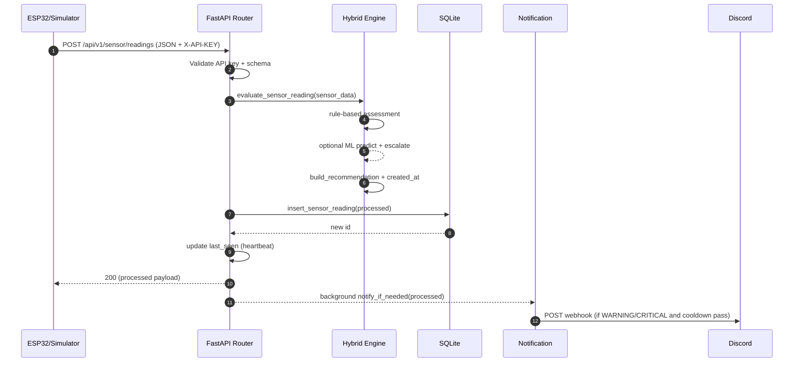
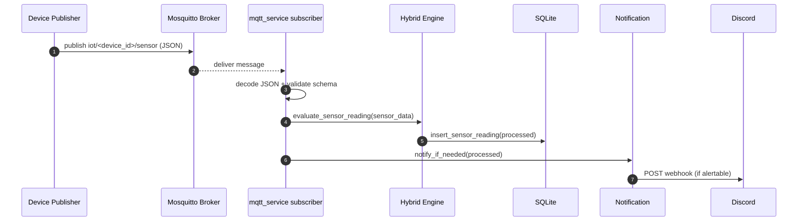

# BÁO CÁO KHOA HỌC (DẠNG LUẬN VĂN)

## HỆ THỐNG IoT GIÁM SÁT SỨC KHỎE & TIỆN NGHI MÔI TRƯỜNG TRONG NHÀ

**Tên dự án (repo)**: IoT-DoAn  
**Nhánh**: `feature/integrated-edge-cloud`  
**Nhóm**: (điền thông tin nhóm/lớp)  
**Ngày**: 2026-05-13

---

## TÓM TẮT (ABSTRACT)

Hệ thống giám sát môi trường trong nhà là một bài toán IoT điển hình, trong đó dữ liệu cảm biến đa nguồn (nhiệt độ, độ ẩm, chất lượng không khí, ánh sáng, tiếng ồn) cần được thu thập theo thời gian thực, chuẩn hóa, đánh giá rủi ro và cung cấp khuyến nghị hành động có thể giải thích. Báo cáo này trình bày thiết kế và hiện thực một hệ thống IoT end-to-end gồm: (i) **lớp Edge** dùng ESP32 đọc cảm biến và gửi dữ liệu bằng HTTP (tương thích endpoint legacy) với cơ chế cấu hình WiFi động và fallback cloud; (ii) **lớp Logic** là backend FastAPI (Python) thực hiện kiểm tra hợp lệ payload, đánh giá tiện nghi bằng **hybrid engine** kết hợp **rule-based** (deterministic, dễ giải thích) và **mô hình RandomForest** (phát hiện bất thường/leo thang rủi ro), lưu trữ vào SQLite và phát cảnh báo qua Discord webhook có cơ chế chống spam; (iii) **lớp Trình bày** là dashboard HTML/Jinja2 hiển thị trạng thái hiện tại và lịch sử.

Khác với hướng tiếp cận “AI-only”, hệ thống ưu tiên **an toàn và khả năng giải thích**: rule-based đóng vai trò baseline quyết định và tạo điểm rủi ro, ML chỉ đóng vai trò bổ trợ để nâng mức cảnh báo khi phát hiện dấu hiệu bất thường trên tập đặc trưng lõi. Do chưa có số liệu thực nghiệm chuẩn hóa trong repo, báo cáo không đưa ra các giá trị benchmark định lượng; thay vào đó đề xuất một **kế hoạch đánh giá** (evaluation plan) gồm các giả thuyết, chỉ số đo (E2E latency, throughput ingest, độ tin cậy MQTT, chất lượng ML trên dữ liệu thật), giao thức thí nghiệm và các mối đe dọa đến tính đúng đắn của kết quả.

**Từ khóa**: Internet of Things (IoT), FastAPI, MQTT, Edge Logic, Rule-based, RandomForest, Discord Webhook, SQLite, Explainable Monitoring.

---

## MỤC LỤC

- [Danh mục thuật ngữ](#danh-mục-thuật-ngữ)
- [Chương I. Tổng quan](#chương-i-tổng-quan)
- [Chương II. Cơ sở lý thuyết](#chương-ii-cơ-sở-lý-thuyết)
- [Chương III. Thiết kế hệ thống](#chương-iii-thiết-kế-hệ-thống)
- [Chương IV. Triển khai hệ thống](#chương-iv-triển-khai-hệ-thống)
- [Chương V. Kế hoạch demo & đánh giá thực nghiệm (không bịa số liệu)](#chương-v-kế-hoạch-demo--đánh-giá-thực-nghiệm-không-bịa-số-liệu)
- [Kết luận](#kết-luận)
- [Tài liệu tham khảo](#tài-liệu-tham-khảo)
- [Phụ lục](#phụ-lục)

---

## DANH MỤC THUẬT NGỮ

- **Edge**: Thiết bị/cấp thu thập dữ liệu gần nguồn (ESP32 + cảm biến).
- **Backend / Logic layer**: Dịch vụ trung tâm tiếp nhận/đánh giá/lưu trữ và cung cấp API.
- **Payload**: Gói JSON dữ liệu cảm biến gửi từ Edge lên backend.
- **Rule-based**: Logic định ngưỡng và luật suy diễn xác định.
- **Hybrid engine**: Cơ chế kết hợp rule-based và ML.
- **MQTT**: Giao thức publish/subscribe cho IoT.
- **Webhook**: Cơ chế HTTP gọi ngược sang dịch vụ khác (Discord) để thông báo.
- **E2E latency**: Độ trễ end-to-end từ lúc đo đến lúc hiển thị/cảnh báo.

---

# CHƯƠNG I. TỔNG QUAN

## 1.1. Bối cảnh và động cơ nghiên cứu

Trong môi trường sống và làm việc trong nhà, các yếu tố như nhiệt độ, độ ẩm, chất lượng không khí, ánh sáng và tiếng ồn tác động trực tiếp đến sức khỏe và hiệu suất. Các hệ thống IoT (Internet of Things) cho phép xây dựng một chuỗi xử lý dữ liệu thời gian thực: từ thiết bị cảm biến (Edge) đến nền tảng phân tích trung tâm (Backend), sau đó hiển thị/đẩy cảnh báo cho người dùng.

Tuy nhiên, một hệ thống giám sát hiệu quả không chỉ dừng ở việc “hiển thị số đo” mà cần:

- Chuẩn hóa và kiểm tra hợp lệ dữ liệu cảm biến (đảm bảo tính nhất quán khi nhiều thiết bị, nhiều kênh truyền).
- Đánh giá rủi ro/tiện nghi theo ngữ cảnh, có khả năng giải thích.
- Cảnh báo kịp thời nhưng **không spam** khi thiết bị gửi dữ liệu với tần suất cao.
- Triển khai đơn giản, tái lập được để phục vụ demo và kiểm thử (Docker, script triển khai cloud).

Vì vậy, đồ án lựa chọn kiến trúc kết hợp **rule-based** (an toàn, dễ kiểm thử/giải thích) với **ML nhẹ** (RandomForest) nhằm tăng khả năng phát hiện bất thường và giảm phụ thuộc hoàn toàn vào ngưỡng cứng.

## 1.2. Mục tiêu đồ án

Mục tiêu tổng quát: xây dựng hệ thống IoT end-to-end giám sát môi trường trong nhà, đánh giá mức tiện nghi và phát cảnh báo chủ động.

Mục tiêu cụ thể:

1. **Thu thập dữ liệu cảm biến** từ ESP32 (hoặc simulator) theo chu kỳ định kỳ.
2. **Tiếp nhận dữ liệu** qua HTTP API chuẩn hóa và giữ **endpoint legacy** để tương thích firmware.
3. **Đánh giá tiện nghi/rủi ro** bằng edge logic triển khai phía server (rule-based) và tích hợp ML.
4. **Lưu trữ lịch sử** vào SQLite để truy vấn latest/history.
5. **Cảnh báo Discord** đối với trạng thái WARNING/CRITICAL và có cơ chế cooldown.
6. **Hỗ trợ MQTT** như một kênh ingest thay thế (publish/subscribe) để phù hợp IoT.
7. **Dashboard** phục vụ quan sát realtime và truy vết lịch sử.
8. **Triển khai** bằng Docker Compose và có script triển khai lên Azure VM.

## 1.3. Phạm vi và giới hạn

**Trong phạm vi**:

- Cảm biến: DHT22 (temperature/humidity), MQ135 (gas), BH1750 (lux), MAX4466 (noise raw).
- Backend FastAPI (Python), database SQLite, dashboard HTML/Jinja2.
- MQTT broker (Mosquitto) và subscriber phía backend.
- Discord webhook alert.
- Hybrid engine: rule-based là chính; ML RandomForest dựa trên tập đặc trưng {temperature, humidity, gas}.

**Ngoài phạm vi / giới hạn hiện tại**:

- Không có số liệu benchmark định lượng chính thức được version-control trong repo.
- Mobile app trong repo ở dạng scaffold (Capacitor) — chưa đủ để phân tích UX/luồng chức năng chi tiết.
- ML model hiện là proof-of-concept (PoC) và cần dữ liệu thật để đánh giá đầy đủ.

## 1.4. Đóng góp kỹ thuật

So với một prototype IoT tối giản, dự án đóng góp một số điểm mang tính “engineering-ready”:

- Kiến trúc backend module hóa (routers/services/utils) giúp mở rộng dễ hơn.
- Chiến lược **compatibility**: duy trì endpoint legacy `POST /data` song song với endpoint chuẩn `POST /api/v1/sensor/readings`.
- Kênh cảnh báo Discord có **cooldown** theo (device_id, status) để giảm spam.
- Hỗ trợ ingest bằng MQTT theo topic wildcard `iot/+/sensor`.
- Triển khai Docker Compose + script triển khai Azure, hỗ trợ vận hành demo 24/7.

## 1.5. Bố cục báo cáo

- Chương II trình bày nền tảng lý thuyết liên quan.
- Chương III mô tả thiết kế kiến trúc, luồng dữ liệu, mô hình dữ liệu và thuật toán đánh giá.
- Chương IV mô tả triển khai, tổ chức mã nguồn, cấu hình và vận hành.
- Chương V đề xuất kế hoạch thí nghiệm/đánh giá (không bịa số liệu).

---

# CHƯƠNG II. CƠ SỞ LÝ THUYẾT

## 2.1. Mô hình tham chiếu hệ thống IoT

Một hệ thống IoT điển hình có thể được mô tả qua ba lớp:

1. **Edge layer**: thu thập tín hiệu vật lý, chuyển đổi thành số liệu (sensor readings), và truyền thông.
2. **Logic layer**: tiếp nhận dữ liệu, xác thực, làm giàu (enrichment), ra quyết định (assessment), lưu trữ.
3. **Presentation layer**: hiển thị, truy vấn lịch sử, và cảnh báo cho người dùng.

Điểm quan trọng: dữ liệu cảm biến thường nhiễu và tần suất cao; do đó cơ chế kiểm soát chất lượng dữ liệu và chống spam cảnh báo là cần thiết.

## 2.2. Giao thức MQTT trong IoT

MQTT (Message Queuing Telemetry Transport) là giao thức publish/subscribe nhẹ, phù hợp môi trường băng thông hạn chế và thiết bị resource-constrained. Trong hệ thống này:

- Broker: **Eclipse Mosquitto**.
- Topic subscribe phía backend: `iot/+/sensor`.
- Payload MQTT sử dụng cùng schema với HTTP API để đảm bảo “một hợp đồng dữ liệu”.

Ưu điểm: tách rời publisher/subscriber, dễ mở rộng nhiều thiết bị. Hạn chế: cần xử lý reconnect, QoS, và quản trị topic/ACL khi scale lớn.

## 2.3. Rule-based edge logic và tính giải thích

Rule-based là phương pháp ánh xạ trực tiếp từ các điều kiện ngưỡng sang mức cảnh báo và lý do (reasons). Ưu điểm:

- **Giải thích rõ** (vì sao cảnh báo).
- **Dễ kiểm thử** (test theo bảng ngưỡng).
- **An toàn vận hành** (không phụ thuộc dữ liệu huấn luyện).

Hạn chế:

- Cứng nhắc ở vùng “cận ngưỡng”.
- Khó tổng hợp tương tác đa yếu tố nếu chỉ dùng ngưỡng độc lập.

## 2.4. RandomForest cho phân loại trạng thái tiện nghi

RandomForest là mô hình ensemble trên cây quyết định, phù hợp cho dữ liệu tabular và thường ổn định với nhiễu. Trong dự án:

- Feature set tối thiểu: `{temperature, humidity, gas}`.
- Output: mức comfort/risk (0/1/2 tương ứng NORMAL/WARNING/CRITICAL).

Trong thiết kế hybrid, ML không thay thế rule-based mà dùng để **escalate** khi phát hiện dấu hiệu bất thường. Cách làm này giảm rủi ro “ML sai hoàn toàn” nhưng vẫn tận dụng được khả năng tổng hợp phi tuyến của mô hình.

## 2.5. Lưu trữ SQLite cho prototype

SQLite là CSDL nhúng, không cần server riêng, phù hợp cho demo/prototype. Khi nhu cầu concurrency/scale tăng, có thể migrate sang PostgreSQL/MySQL.

## 2.6. Bảo mật tối thiểu trong hệ IoT demo

Hệ thống sử dụng:

- API key truyền qua header `X-API-KEY` cho endpoint ingest.
- Token query param cho dashboard (truy cập HTML).
- Secrets quản lý qua `.env` (không commit webhook URL thật).

Trong môi trường triển khai thật, cần bổ sung HTTPS/TLS, rotate keys, và cơ chế auth mạnh hơn.

## 2.7. Chất lượng dữ liệu cảm biến (Data Quality) và hiệu chỉnh ngưỡng

Trong hệ IoT, độ tin cậy của quyết định phụ thuộc trực tiếp vào chất lượng dữ liệu đầu vào. Các cảm biến phổ biến như MQ135 (khí) và module microphone (noise raw) thường chịu ảnh hưởng bởi:

- Sai số do nhiệt độ/độ ẩm nền, vị trí lắp đặt, thời gian warm-up.
- Nhiễu điện, nhiễu ADC, dao động nguồn cấp.
- Trôi (drift) theo thời gian.

Do đó, khi thiết kế rule-based, các ngưỡng trong repo cần được hiểu như **ngưỡng demo/baseline**. Một quy trình hiệu chỉnh ngưỡng tối thiểu nên có:

1. Ghi nhận baseline theo thời gian (ít nhất nhiều phiên đo, nhiều thời điểm trong ngày).
2. Xác định phân phối (median, percentile) và outliers.
3. Đặt ngưỡng theo nguyên tắc: ưu tiên giảm false negative cho CRITICAL (an toàn) nhưng cân bằng để không spam.
4. Kiểm chứng trên bối cảnh phòng/điều kiện cụ thể.

Trong thiết kế hybrid, dữ liệu chất lượng thấp sẽ gây ra hai dạng lỗi:

- **Rule-only false alarm**: một chỉ số nhiễu vượt ngưỡng.
- **ML false escalation**: ML nhạy với nhiễu cục bộ (nếu không được huấn luyện/cân bằng dữ liệu phù hợp).

## 2.8. Thiết kế hệ thống thời gian thực: sampling, jitter và đồng bộ thời gian

Hệ thống hiện sử dụng chu kỳ gửi dữ liệu 5 giây ở firmware. Trên thực tế, sampling và truyền tải bị ảnh hưởng bởi:

- Jitter từ vòng lặp đọc cảm biến.
- Độ trễ WiFi/Internet, NAT, container networking.
- Độ trễ xử lý backend.

Việc đo E2E latency (Chương V) cần tách biệt các thành phần: latency do thiết bị, do mạng, do server, do UI.

Ngoài ra, nếu so sánh timestamp giữa ESP32 và backend, phải lưu ý đồng bộ thời gian (NTP) hoặc chấp nhận sai số; trong đồ án, có thể ưu tiên đo theo timestamp phía backend (server-side) để giảm phụ thuộc đồng hồ thiết bị.

## 2.9. Quan sát hệ thống (Observability) trong bối cảnh đồ án

Mặc dù repo không tích hợp Prometheus/Grafana, hệ thống vẫn có các “điểm quan sát” khả dụng:

- Log backend (docker logs) cho lỗi payload, lỗi MQTT, lỗi Discord.
- Dữ liệu SQLite như một dạng telemetry history.
- Health endpoint phản ánh tình trạng DB và heartbeat thiết bị.

Để mở rộng theo hướng “hệ thống hóa đánh giá”, có thể bổ sung:

- Structured logging (JSON logs) cho pipeline ingest.
- Metrics nội bộ (counter/timer) cho số reading, lỗi validate, thời gian xử lý.

---

## 2.7. Chất lượng dữ liệu cảm biến (Data Quality) và hiệu chỉnh ngưỡng

Trong hệ IoT, độ tin cậy của quyết định phụ thuộc trực tiếp vào chất lượng dữ liệu đầu vào. Các cảm biến phổ biến như MQ135 (khí) và module microphone (noise raw) thường chịu ảnh hưởng bởi:

- Sai số do nhiệt độ/độ ẩm nền, vị trí lắp đặt, thời gian warm-up.
- Nhiễu điện, nhiễu ADC, dao động nguồn cấp.
- Trôi (drift) theo thời gian.

Do đó, khi thiết kế rule-based, các ngưỡng trong repo cần được hiểu như **ngưỡng demo/baseline**. Một quy trình hiệu chỉnh ngưỡng tối thiểu nên có:

1. Ghi nhận baseline theo thời gian (ít nhất nhiều phiên đo, nhiều thời điểm trong ngày).
2. Xác định phân phối (median, percentile) và outliers.
3. Đặt ngưỡng theo nguyên tắc: ưu tiên giảm false negative cho CRITICAL (an toàn) nhưng cân bằng để không spam.
4. Kiểm chứng trên bối cảnh phòng/điều kiện cụ thể.

Trong thiết kế hybrid, dữ liệu chất lượng thấp sẽ gây ra hai dạng lỗi:

- **Rule-only false alarm**: một chỉ số nhiễu vượt ngưỡng.
- **ML false escalation**: ML nhạy với nhiễu cục bộ (nếu không được huấn luyện/cân bằng dữ liệu phù hợp).

## 2.8. Thiết kế hệ thống thời gian thực: sampling, jitter và đồng bộ thời gian

Hệ thống hiện sử dụng chu kỳ gửi dữ liệu 5 giây ở firmware. Trên thực tế, sampling và truyền tải bị ảnh hưởng bởi:

- Jitter từ vòng lặp đọc cảm biến.
- Độ trễ WiFi/Internet, NAT, container networking.
- Độ trễ xử lý backend.

Việc đo E2E latency (Chương V) cần tách biệt các thành phần: latency do thiết bị, do mạng, do server, do UI.

Ngoài ra, nếu so sánh timestamp giữa ESP32 và backend, phải lưu ý đồng bộ thời gian (NTP) hoặc chấp nhận sai số; trong đồ án, có thể ưu tiên đo theo timestamp phía backend (server-side) để giảm phụ thuộc đồng hồ thiết bị.

## 2.9. Quan sát hệ thống (Observability) trong bối cảnh đồ án

Mặc dù repo không tích hợp Prometheus/Grafana, hệ thống vẫn có các “điểm quan sát” khả dụng:

- Log backend (docker logs) cho lỗi payload, lỗi MQTT, lỗi Discord.
- Dữ liệu SQLite như một dạng telemetry history.
- Health endpoint phản ánh tình trạng DB và heartbeat thiết bị.

Để mở rộng theo hướng “hệ thống hóa đánh giá”, có thể bổ sung:

- Structured logging (JSON logs) cho pipeline ingest.
- Metrics nội bộ (counter/timer) cho số reading, lỗi validate, thời gian xử lý.

---

---

# CHƯƠNG III. THIẾT KẾ HỆ THỐNG

## 3.1. Yêu cầu chức năng

- Nhận dữ liệu cảm biến từ ESP32/simulator qua HTTP.
- Nhận dữ liệu cảm biến qua MQTT.
- Validate payload theo schema thống nhất.
- Đánh giá comfort_level/status_label/risk_score và sinh reasons/recommendation.
- Lưu dữ liệu vào SQLite.
- Cung cấp API latest/history.
- Cảnh báo Discord khi WARNING/CRITICAL, có cooldown.
- Dashboard hiển thị trạng thái và lịch sử.
- Health check phản ánh trạng thái backend + database + tình trạng thiết bị (heartbeat).

## 3.2. Yêu cầu phi chức năng

- Tái lập triển khai (Docker Compose).
- Dễ vận hành demo cloud (script deploy Azure).
- Khả năng giải thích (reasons + recommendation).
- Chống spam cảnh báo.
- Khả năng mở rộng: multi-device, multi-source ingest.

## 3.3. Kiến trúc tổng thể

### 3.3.1. Mô hình 3 lớp

```mermaid
flowchart TB
  subgraph Edge[Edge Layer]
    ESP[ESP32 + Sensors]
  end

  subgraph Logic[Logic Layer]
    API[FastAPI Backend]
    Hybrid[Hybrid Engine\n(rule-based + RandomForest)]
    DB[(SQLite)]
    MQTT[MQTT Subscriber]
    Disc[Discord Webhook]
  end

  subgraph UI[Presentation Layer]
    Dash[Dashboard (Jinja2 + Chart.js)]
    Mobile[Mobile App (Capacitor) - scaffold]
  end

  ESP -->|HTTP POST /data or /api/v1/sensor/readings| API
  ESP -->|MQTT publish iot/<device>/sensor| MQTT

  MQTT --> Hybrid
  API --> Hybrid

  Hybrid --> DB
  DB --> API

  Hybrid -->|WARNING/CRITICAL| Disc
  API --> Dash
  API --> Mobile
```

### 3.3.2. Luồng dữ liệu chuẩn hóa

1. Edge đo cảm biến → tạo JSON payload.
2. Payload đi qua HTTP hoặc MQTT.
3. Backend validate payload (schema).
4. Hybrid engine đánh giá: rule-based → (tùy chọn) ML escalate.
5. Sinh recommendation.
6. Ghi DB và trả response (HTTP) hoặc ghi log (MQTT path).
7. Nếu WARNING/CRITICAL: gửi Discord webhook có cooldown.
8. UI gọi API latest/history để hiển thị.

## 3.4. Thiết kế hợp đồng dữ liệu (data contract)

### 3.4.1. Schema đầu vào

Payload thống nhất (HTTP/MQTT):

```json
{
  "device_id": "esp32_01",
  "temperature": 30.5,
  "humidity": 72.0,
  "gas": 1250,
  "light": 650,
  "noise": 320
}
```

Ràng buộc (tóm lược theo schema):

- `temperature`: [-20, 80]
- `humidity`: [0, 100]
- `gas`, `noise`: integer >= 0
- `light`: float >= 0

### 3.4.2. Schema đầu ra sau xử lý

Các trường được làm giàu:

- `comfort_level`: 0/1/2
- `status_label`: NORMAL/WARNING/CRITICAL
- `risk_score`: 0..100
- `reasons`: list string
- `recommendation`: string
- `created_at`: timestamp UTC+7

## 3.5. Thiết kế API

### 3.5.1. API chuẩn (versioned)

- `POST /api/v1/sensor/readings` (ingest)
- `GET /api/v1/sensor/latest`
- `GET /api/v1/sensor/history?limit=N`
- `GET /api/v1/system/health`
- `GET /api/v1/devices/default` (metadata)

Auth ingest: header `X-API-KEY` khi bật `REQUIRE_API_KEY`.

### 3.5.2. API legacy để tương thích firmware

- `POST /data`: nhận payload cùng schema và trả format legacy.
- `GET /history`: trả danh sách format legacy.

**Lý do thiết kế**: giảm friction tích hợp phần cứng; firmware không bắt buộc đổi endpoint ngay.

## 3.6. Thiết kế lưu trữ dữ liệu (SQLite)

Bảng `sensor_readings` gồm:

- `id` (auto increment)
- `device_id`
- `temperature`, `humidity`, `gas`, `light`, `noise`
- `comfort_level`, `status_label`, `risk_score`
- `reasons` (JSON string)
- `recommendation`
- `created_at` (text)

Thiết kế này tối ưu cho truy vấn “latest” và “history by id desc”.

### 3.6.1. DDL (theo hiện thực trong backend)

```sql
CREATE TABLE IF NOT EXISTS sensor_readings (
  id INTEGER PRIMARY KEY AUTOINCREMENT,
  device_id TEXT NOT NULL,
  temperature REAL NOT NULL,
  humidity REAL NOT NULL,
  gas INTEGER NOT NULL,
  light REAL NOT NULL,
  noise INTEGER NOT NULL,
  comfort_level INTEGER NOT NULL,
  status_label TEXT NOT NULL,
  risk_score INTEGER NOT NULL,
  reasons TEXT NOT NULL,
  recommendation TEXT NOT NULL,
  created_at TEXT NOT NULL
);
```

Điểm quan trọng: `reasons` được lưu dưới dạng **JSON string** (mảng chuỗi) để giữ tính giải thích mà không cần chuẩn hóa thành bảng phụ. Đây là lựa chọn hợp lý cho đồ án, nhưng khi cần analytics nâng cao có thể cân nhắc:

- Chuẩn hóa `reasons` thành bảng `reading_reasons(reading_id, reason)` hoặc JSON column (nếu DB hỗ trợ).
- Thêm index theo `device_id` và/hoặc `created_at` nếu truy vấn theo thiết bị/thời gian tăng.

## 3.7. Thiết kế rule-based edge assessment

### 3.7.1. Luật ngưỡng và điểm rủi ro

Hệ thống tính `risk_score` bằng cách cộng dồn điểm theo các điều kiện:

- Nhiệt độ: >40 (+35, critical_flag), 35..40 (+20), <18 (+10)
- Độ ẩm: >90 (+20), 85..90 (+15), <30 (+10)
- Gas: >3000 (+40, critical_flag), 2000..3000 (+25), 1200..2000 (+10)
- Ánh sáng: <10 (+15), 10..50 (+8)
- Tiếng ồn: >3000 (+20), 2000..3000 (+10)
- Penalty: nếu có từ 3 lý do trở lên (+10)

Để trình bày rõ ràng hơn, có thể chuẩn hóa thành bảng:

| Nhóm        | Điều kiện           | Điểm | Ghi chú                |
| ----------- | ------------------- | ---: | ---------------------- |
| Temperature | `temperature > 40`  |  +35 | `critical_flag = true` |
| Temperature | `temperature > 35`  |  +20 |                        |
| Temperature | `temperature < 18`  |  +10 |                        |
| Humidity    | `humidity > 90`     |  +20 |                        |
| Humidity    | `humidity > 85`     |  +15 |                        |
| Humidity    | `humidity < 30`     |  +10 |                        |
| Gas         | `gas > 3000`        |  +40 | `critical_flag = true` |
| Gas         | `gas > 2000`        |  +25 |                        |
| Gas         | `gas > 1200`        |  +10 |                        |
| Light       | `light < 10`        |  +15 |                        |
| Light       | `light < 50`        |   +8 |                        |
| Noise       | `noise > 3000`      |  +20 |                        |
| Noise       | `noise > 2000`      |  +10 |                        |
| Compound    | `len(reasons) >= 3` |  +10 | “Multiple abnormal…”   |

Giới hạn: `risk_score` được clamp về [0, 100].

### 3.7.2. Quy tắc phân loại trạng thái

- Nếu `critical_flag == true` hoặc `risk_score >= 75` → `CRITICAL`.
- Ngược lại, nếu `risk_score >= 25` hoặc có lý do bất thường → `WARNING`.
- Ngược lại → `NORMAL` (kèm lý do tổng quát “trong ngưỡng chấp nhận”).

### 3.7.3. Pseudocode

```text
input: sensor_data
risk_score = 0; reasons = []; critical_flag = false

apply thresholds for temperature/humidity/gas/light/noise
if gas or temperature critical => critical_flag = true
if len(reasons) >= 3 => risk_score += 10; reasons += ["Multiple abnormal..."]
risk_score = clamp(risk_score, 0, 100)

if critical_flag or risk_score >= 75 => status=CRITICAL, comfort=2
else if risk_score >= 25 or reasons not empty => status=WARNING, comfort=1
else => status=NORMAL, comfort=0; reasons=["All ... acceptable"]

output: comfort_level, status_label, risk_score, reasons
```

## 3.8. Thiết kế Hybrid ML + Rule-based

### 3.8.1. Vai trò ML trong hybrid

- Rule-based vẫn là “nguồn chân lý” cho `risk_score` và lý do.
- ML dự đoán `ai_comfort ∈ {0,1,2}` trên 3 feature `{temp, humid, gas}`.
- Kết quả cuối: `final_comfort = max(rule_comfort, ai_comfort)`.
- Nếu ML leo thang (escalate), hệ thống append lý do: `"AI Anomaly Detection"`.

### 3.8.2. Giới hạn hiện tại

- Nếu ML nâng mức nhưng `risk_score` vẫn theo rule-based, có thể tạo ra “bất nhất mềm”: trạng thái tăng nhưng điểm rủi ro không tăng tương ứng.
- ML bỏ qua `light` và `noise`.
- Model file `comfort_model.pkl` có thể không tồn tại trong runtime; khi đó hệ thống tự fallback về rule-only.

Nhận xét khoa học: “bất nhất mềm” không nhất thiết là sai trong bối cảnh đồ án (vì `risk_score` được định nghĩa là rule-score), nhưng cần **định nghĩa rõ semantics**:

- Nếu `status_label` được xem là “mức cảnh báo cuối”, thì cần giải thích rằng ML chỉ can thiệp **mức** chứ không thay đổi **điểm**.
- Nếu muốn nhất quán hơn, có thể (trong future work) lưu thêm trường `ai_comfort` và/hoặc `final_risk_score` để phân biệt:
  - `rule_risk_score` (giải thích theo luật)
  - `final_status_label` (quyết định cuối)

Trong đánh giá, nên đo riêng:

- Tỷ lệ case ML escalate từ NORMAL→WARNING hoặc WARNING→CRITICAL.
- Phân tích nguyên nhân: do feature set giới hạn (chỉ temp/humid/gas) hay do phân phối dữ liệu.

## 3.9. Thiết kế khuyến nghị (recommendation)

Khuyến nghị sinh theo nguyên tắc “human-centered”: thiết bị IoT là điểm đo cố định; khuyến nghị hướng dẫn con người cải thiện môi trường, không yêu cầu thay đổi thiết bị.

Recommendation dựa trên `status_label` và text matching của `reasons` (gas/temp/humidity/light/noise/multiple).

## 3.10. Thiết kế cảnh báo Discord và cooldown

- Chỉ gửi Discord khi `status_label ∈ {WARNING, CRITICAL}`.
- Cooldown theo khóa `device_id:status_label`, mặc định 60 giây.
- Payload Discord sử dụng embed chứa thông tin cảm biến, reasons, recommendation.

## 3.11. Thiết kế health check và heartbeat

Endpoint `GET /api/v1/system/health` trả về:

- Trạng thái database (ok/error)
- Trạng thái thiết bị (online/offline) dựa trên timestamp `last_seen`

Lưu ý kỹ thuật: `last_seen` được cập nhật trong pipeline HTTP ingest; đường MQTT ingest hiện chưa cập nhật `last_seen`. Đây là một điểm cần cải tiến nếu muốn health phản ánh “thiết bị đang gửi qua MQTT”.

## 3.12. Quản trị cấu hình và tham số hệ thống

Thiết kế cấu hình tập trung trong `Settings` giúp:

- Tách secrets và tham số runtime khỏi code.
- Cho phép chạy cùng code ở local, Docker và cloud bằng việc thay `.env`.

Các nhóm cấu hình chính:

1. **Network**: host/port backend.
2. **Security**: API key, dashboard token.
3. **Integration**: Discord webhook, MQTT broker.
4. **Operational**: cooldown seconds, topic wildcard.

Nguyên tắc vận hành đề xuất:

- Không commit `.env` và không commit webhook URL thật.
- Đổi key/token trước khi demo công khai.
- Nếu chạy cloud, cân nhắc firewall cho port 1883 (MQTT) và 8000 (HTTP).

## 3.13. Quản trị lỗi và nguyên tắc “không sập hệ thống”

Một hệ thống ingest sensor phải xử lý được payload lỗi mà không làm backend bị sập. Repo hiện áp dụng:

- Với MQTT: bắt lỗi JSON decode, schema validation, lỗi runtime và chỉ log.
- Với Discord: bắt lỗi network/HTTP >=400 và trả trạng thái gửi thất bại.

Các failure mode cần thảo luận khi mở rộng:

- Broker mất kết nối: cần reconnect strategy và backoff.
- Discord webhook bị rate-limit: cần retry có kiểm soát và queue.
- DB file lock (SQLite) khi concurrency tăng: cân nhắc WAL mode hoặc migrate DB.

## 3.14. Mở rộng multi-device và định danh thiết bị

Thiết kế hiện hỗ trợ đa thiết bị ở mức hợp đồng dữ liệu:

- HTTP/MQTT payload có `device_id`.
- MQTT topic wildcard `iot/+/sensor`.

Để mở rộng đúng chuẩn, cần bổ sung “device registry” tối thiểu:

- Danh sách thiết bị hợp lệ, thông tin vị trí, loại cảm biến.
- Trạng thái online/offline per device (không chỉ 1 heartbeat toàn app).
- Chính sách cooldown theo device và theo loại cảnh báo.

## 3.15. Bảo mật và phân quyền truy cập (ở mức thiết kế)

Ở mức đồ án, API key và dashboard token là đủ để demo. Tuy nhiên, khi xem xét production-grade:

- HTTPS/TLS bắt buộc để tránh lộ API key.
- Token dashboard qua query param dễ bị lộ qua log/history; nên chuyển sang cookie/session hoặc header-based auth.
- MQTT cần ACL (username/password) và/hoặc TLS.

## 3.16. Quy ước thời gian và timezone

Backend sinh `created_at` theo UTC+7 dưới dạng string. Quy ước này thuận tiện hiển thị dashboard nhưng có hạn chế:

- Không chuẩn hóa theo ISO-8601.
- Khó phân tích chéo vùng giờ.

Trong đánh giá thực nghiệm, cần thống nhất quy ước: hoặc lưu thêm epoch timestamp, hoặc lưu ISO-8601 kèm offset.

## 3.12. Quản trị cấu hình và tham số hệ thống

Thiết kế cấu hình tập trung trong `Settings` giúp:

- Tách secrets và tham số runtime khỏi code.
- Cho phép chạy cùng code ở local, Docker và cloud bằng việc thay `.env`.

Các nhóm cấu hình chính:

1. **Network**: host/port backend.
2. **Security**: API key, dashboard token.
3. **Integration**: Discord webhook, MQTT broker.
4. **Operational**: cooldown seconds, topic wildcard.

Nguyên tắc vận hành đề xuất:

- Không commit `.env` và không commit webhook URL thật.
- Đổi key/token trước khi demo công khai.
- Nếu chạy cloud, cân nhắc firewall cho port 1883 (MQTT) và 8000 (HTTP).

## 3.13. Quản trị lỗi và nguyên tắc “không sập hệ thống”

Một hệ thống ingest sensor phải xử lý được payload lỗi mà không làm backend bị sập. Repo hiện áp dụng:

- Với MQTT: bắt lỗi JSON decode, schema validation, lỗi runtime và chỉ log.
- Với Discord: bắt lỗi network/HTTP >=400 và trả trạng thái gửi thất bại.

Các failure mode cần thảo luận khi mở rộng:

- Broker mất kết nối: cần reconnect strategy và backoff.
- Discord webhook bị rate-limit: cần retry có kiểm soát và queue.
- DB file lock (SQLite) khi concurrency tăng: cân nhắc WAL mode hoặc migrate DB.

## 3.14. Mở rộng multi-device và định danh thiết bị

Thiết kế hiện hỗ trợ đa thiết bị ở mức hợp đồng dữ liệu:

- HTTP/MQTT payload có `device_id`.
- MQTT topic wildcard `iot/+/sensor`.

Để mở rộng đúng chuẩn, cần bổ sung “device registry” tối thiểu:

- Danh sách thiết bị hợp lệ, thông tin vị trí, loại cảm biến.
- Trạng thái online/offline per device (không chỉ 1 heartbeat toàn app).
- Chính sách cooldown theo device và theo loại cảnh báo.

## 3.15. Bảo mật và phân quyền truy cập (ở mức thiết kế)

Ở mức đồ án, API key và dashboard token là đủ để demo. Tuy nhiên, khi xem xét production-grade:

- HTTPS/TLS bắt buộc để tránh lộ API key.
- Token dashboard qua query param dễ bị lộ qua log/history; nên chuyển sang cookie/session hoặc header-based auth.
- MQTT cần ACL (username/password) và/hoặc TLS.

## 3.16. Quy ước thời gian và timezone

Backend sinh `created_at` theo UTC+7 dưới dạng string. Quy ước này thuận tiện hiển thị dashboard nhưng có hạn chế:

- Không chuẩn hóa theo ISO-8601.
- Khó phân tích chéo vùng giờ.

Trong đánh giá thực nghiệm, cần thống nhất quy ước: hoặc lưu thêm epoch timestamp, hoặc lưu ISO-8601 kèm offset.

---

# CHƯƠNG IV. TRIỂN KHAI HỆ THỐNG

## 4.1. Tổng quan tổ chức mã nguồn

Backend được tổ chức theo mô hình “modular FastAPI”:

- `app/main.py`: tạo FastAPI app, gắn router, startup/shutdown.
- `app/config.py`: đọc env vars và định nghĩa settings.
- `app/schemas.py`: Pydantic schema.
- `app/database.py`: SQLite init + insert + query.
- `app/routers/*`: định nghĩa API endpoints.
- `app/services/*`: business logic (edge, hybrid, mqtt, discord, notification).
- `templates/dashboard.html`: dashboard.

### 4.1.1. Bảng phân rã module (module decomposition)

| Nhóm     | Thành phần           | Trách nhiệm                                               | Ghi chú                             |
| -------- | -------------------- | --------------------------------------------------------- | ----------------------------------- |
| Routers  | sensor_router        | Ingest + query latest/history + legacy endpoints          | HTTP path có heartbeat              |
| Routers  | dashboard_router     | Render dashboard HTML + token check                       | Presentation                        |
| Routers  | system_router        | Health check DB + device heartbeat                        | Device heartbeat hiện theo app-wide |
| Services | edge_service         | Rule-based scoring + reasons                              | Nguồn `risk_score`                  |
| Services | comfort_service      | Orchestrate hybrid rule + ML + recommendation + timestamp | ML có thể escalate                  |
| Services | mqtt_service         | Subscribe + decode/validate + persist + notify            | Resilient to bad payload            |
| Services | notification_service | Cooldown + dispatch Discord                               | Anti-spam                           |
| Services | discord_service      | Webhook HTTP POST to Discord                              | Embed payload                       |
| Services | alert_service        | Human-centered recommendation                             | Dựa trên reasons                    |
| Storage  | database             | SQLite init/insert/query                                  | `reasons` lưu JSON string           |

Mục đích của bảng này là giúp thuyết minh rõ “ai làm gì” và hỗ trợ audit khi kiểm thử.

### 4.1.1. Bảng phân rã module (module decomposition)

| Nhóm     | Thành phần           | Trách nhiệm                                               | Ghi chú                             |
| -------- | -------------------- | --------------------------------------------------------- | ----------------------------------- |
| Routers  | sensor_router        | Ingest + query latest/history + legacy endpoints          | HTTP path có heartbeat              |
| Routers  | dashboard_router     | Render dashboard HTML + token check                       | Presentation                        |
| Routers  | system_router        | Health check DB + device heartbeat                        | Device heartbeat hiện theo app-wide |
| Services | edge_service         | Rule-based scoring + reasons                              | Nguồn `risk_score`                  |
| Services | comfort_service      | Orchestrate hybrid rule + ML + recommendation + timestamp | ML có thể escalate                  |
| Services | mqtt_service         | Subscribe + decode/validate + persist + notify            | Resilient to bad payload            |
| Services | notification_service | Cooldown + dispatch Discord                               | Anti-spam                           |
| Services | discord_service      | Webhook HTTP POST to Discord                              | Embed payload                       |
| Services | alert_service        | Human-centered recommendation                             | Dựa trên reasons                    |
| Storage  | database             | SQLite init/insert/query                                  | `reasons` lưu JSON string           |

Mục đích của bảng này là giúp thuyết minh rõ “ai làm gì” và hỗ trợ audit khi kiểm thử.

## 4.2. Pipeline xử lý ingestion (HTTP)

**HTTP path** (chuẩn và legacy) có các bước:

1. Validate API key (nếu bật yêu cầu).
2. Parse payload → dict.
3. `evaluate_sensor_reading()`:
   - rule-based assessment
   - (tuỳ chọn) ML predict và escalate
   - build recommendation
   - add created_at
4. Insert vào SQLite và trả ID.
5. Update `app.state.last_seen` để heartbeat.
6. Trigger `notify_if_needed()` chạy background task.

Điểm thiết kế: notification chạy background để giảm latency response.

### 4.2.1. Sơ đồ trình tự (sequence) cho HTTP ingest



Điểm đáng chú ý trong thiết kế này là tách **đường trả response** khỏi **đường gửi alert**, giúp phản hồi nhanh hơn và hạn chế domino effect khi Discord chậm/lỗi.

### 4.2.1. Sơ đồ trình tự (sequence) cho HTTP ingest


Điểm đáng chú ý trong thiết kế này là tách **đường trả response** khỏi **đường gửi alert**, giúp phản hồi nhanh hơn và hạn chế domino effect khi Discord chậm/lỗi.

## 4.3. Pipeline xử lý ingestion (MQTT)

**MQTT subscriber**:

- Kết nối broker bằng `paho-mqtt`.
- Subscribe topic `iot/+/sensor`.
- Mỗi message:
  - decode JSON
  - validate schema
  - evaluate sensor reading
  - insert DB
  - notify (sync)

Cơ chế chống lỗi:

- Bắt lỗi JSON decode, schema validation, lỗi runtime khác; ghi log và không crash loop.

### 4.3.1. Sơ đồ trình tự (sequence) cho MQTT ingest



Khác với HTTP path, MQTT path hiện gọi notify đồng bộ (không background task). Khi mở rộng tải, có thể cân nhắc tách notification thành async queue để giảm độ trễ xử lý message.

### 4.3.1. Sơ đồ trình tự (sequence) cho MQTT ingest


Khác với HTTP path, MQTT path hiện gọi notify đồng bộ (không background task). Khi mở rộng tải, có thể cân nhắc tách notification thành async queue để giảm độ trễ xử lý message.

## 4.4. Cấu hình môi trường (Settings)

Các biến môi trường quan trọng:

- `IOT_API_KEY`, `REQUIRE_API_KEY`
- `DASHBOARD_TOKEN`
- `ENABLE_DISCORD_ALERT`, `DISCORD_WEBHOOK_URL`, `ALERT_COOLDOWN_SECONDS`
- `ENABLE_MQTT`, `MQTT_HOST`, `MQTT_PORT`, `MQTT_TOPIC`, `MQTT_CLIENT_ID`

Dữ liệu runtime:

- DB: `backend/data/iot_data.db` (mount volume trong Docker).

## 4.5. Dashboard

Dashboard được render bởi Jinja2 và chạy JS/Chart.js để visualize. Dashboard có cơ chế token-based access thông qua query `/?token=...`.

Trong báo cáo này, dashboard được xem như thành phần presentation giúp:

- Quan sát latest reading.
- Quan sát trend history.
- Hiển thị status label + risk score + reasons + recommendation.

### 4.5.1. Nhận xét kỹ thuật về dashboard

Dashboard sử dụng HTML/CSS + Chart.js để hiển thị. Trong phạm vi báo cáo, dashboard được xem là công cụ quan sát và kiểm chứng:

- Đối soát dữ liệu backend (latest/history).
- Kiểm chứng “reasons” và “recommendation” có tính giải thích.

Khi nâng cấp đánh giá thực nghiệm, dashboard nên hỗ trợ export dữ liệu (CSV/JSON) hoặc cung cấp endpoint riêng để trích xuất artifact phục vụ phân tích.

### 4.5.1. Nhận xét kỹ thuật về dashboard

Dashboard sử dụng HTML/CSS + Chart.js để hiển thị. Trong phạm vi báo cáo, dashboard được xem là công cụ quan sát và kiểm chứng:

- Đối soát dữ liệu backend (latest/history).
- Kiểm chứng “reasons” và “recommendation” có tính giải thích.

Khi nâng cấp đánh giá thực nghiệm, dashboard nên hỗ trợ export dữ liệu (CSV/JSON) hoặc cung cấp endpoint riêng để trích xuất artifact phục vụ phân tích.

## 4.6. Firmware ESP32

Firmware thực hiện:

- Đọc cảm biến: DHT22, MQ135 (analog), BH1750 (I2C), MAX4466 (analog).
- WiFiManager: cấu hình WiFi động qua captive portal.
- mDNS: query service `http/tcp` để tìm server nội bộ; nếu không có, fallback về Azure IP.
- Gửi HTTP POST JSON tới endpoint legacy `/data` theo chu kỳ 5 giây.
- Local alert: bật LED và buzzer nếu vượt ngưỡng cục bộ.
- Watchdog: reset để tăng độ ổn định.

Ý nghĩa thiết kế: edge alert là “phản ứng tức thời tại chỗ”, trong khi backend tạo đánh giá tổng hợp và khuyến nghị.

### 4.6.1. Bàn luận về mDNS và chiến lược fallback cloud

Firmware thực hiện query service `http/tcp` thông qua mDNS và chọn bản ghi đầu tiên nếu tìm thấy; nếu không, fallback sang Azure public IP. Chiến lược này phù hợp demo vì:

- Khi ở cùng LAN, có thể tìm server nội bộ để giảm latency.
- Khi không có server nội bộ hoặc demo từ xa, có thể dùng cloud.

Tuy nhiên, để đáng tin cậy hơn khi nhiều dịch vụ http/tcp trong LAN, cần:

- Ràng buộc tên service hoặc TXT record để nhận diện đúng backend.
- Hoặc cấu hình domain riêng (ví dụ `iot-server.local`).

### 4.6.1. Bàn luận về mDNS và chiến lược fallback cloud

Firmware thực hiện query service `http/tcp` thông qua mDNS và chọn bản ghi đầu tiên nếu tìm thấy; nếu không, fallback sang Azure public IP. Chiến lược này phù hợp demo vì:

- Khi ở cùng LAN, có thể tìm server nội bộ để giảm latency.
- Khi không có server nội bộ hoặc demo từ xa, có thể dùng cloud.

Tuy nhiên, để đáng tin cậy hơn khi nhiều dịch vụ http/tcp trong LAN, cần:

- Ràng buộc tên service hoặc TXT record để nhận diện đúng backend.
- Hoặc cấu hình domain riêng (ví dụ `iot-server.local`).

## 4.7. Mô hình triển khai Docker Compose

Docker Compose chạy 2 service:

- `backend`: expose 8000, mount `./backend/data:/app/data`, phụ thuộc `mqtt`.
- `mqtt`: eclipse-mosquitto:2 expose 1883, mount config.

Chính sách restart: `unless-stopped`.

### 4.7.1. Lý do mount volume cho SQLite

Backend mount `./backend/data:/app/data` nhằm:

- Giữ dữ liệu qua lần restart container.
- Dễ trích xuất DB để phân tích/đánh giá.

Đây là một quyết định hợp lý cho đồ án. Khi triển khai thật, cần chiến lược backup và quản lý quyền truy cập file DB.

### 4.7.1. Lý do mount volume cho SQLite

Backend mount `./backend/data:/app/data` nhằm:

- Giữ dữ liệu qua lần restart container.
- Dễ trích xuất DB để phân tích/đánh giá.

Đây là một quyết định hợp lý cho đồ án. Khi triển khai thật, cần chiến lược backup và quản lý quyền truy cập file DB.

## 4.8. Triển khai lên Azure VM

Script `deploy_iot.ps1`:

- Đóng gói source thành tarball và exclude một số thư mục (docs, firmware, mobile, data runtime...).
- SCP lên VM và chạy `docker compose up -d --build`.
- Có lệnh `stop`, `status`, `logs`.

Đây là một cách triển khai phù hợp cho đồ án: đơn giản, tái lập, dễ demo.

### 4.8.1. Nhận xét về packaging/exclude

Script deploy exclude các thư mục lớn hoặc không cần cho runtime (docs, firmware, mobile, data). Điều này giảm thời gian upload và tránh ghi đè dữ liệu runtime.

Tuy nhiên, nếu cần phục vụ “thu thập artifact đánh giá” trên cloud, nên cân nhắc:

- Lưu riêng thư mục `results/` hoặc `artifacts/` trên VM.
- Không xóa dữ liệu khi redeploy.

### 4.8.1. Nhận xét về packaging/exclude

Script deploy exclude các thư mục lớn hoặc không cần cho runtime (docs, firmware, mobile, data). Điều này giảm thời gian upload và tránh ghi đè dữ liệu runtime.

Tuy nhiên, nếu cần phục vụ “thu thập artifact đánh giá” trên cloud, nên cân nhắc:

- Lưu riêng thư mục `results/` hoặc `artifacts/` trên VM.
- Không xóa dữ liệu khi redeploy.

---

# CHƯƠNG V. KẾ HOẠCH DEMO & ĐÁNH GIÁ THỰC NGHIỆM (KHÔNG BỊA SỐ LIỆU)

> Ghi chú: Repo hiện chưa lưu các artifact benchmark định lượng (csv, summary). Vì vậy chương này trình bày **phương pháp đo** và **giao thức thí nghiệm** để nhóm có thể chạy và điền số liệu sau.

## 5.1. Câu hỏi nghiên cứu và giả thuyết

- **RQ1**: Rule-based assessment có phân loại đúng theo bảng ngưỡng không?
  - **H1**: Với các test-case biên (boundary cases), status_label khớp với kỳ vọng theo luật.

- **RQ2**: Hybrid ML có giúp phát hiện bất thường ở vùng cận ngưỡng không?
  - **H2**: Trên dữ liệu thật (được gán nhãn), hybrid giảm false negative so với rule-only.

- **RQ3**: MQTT ingest có cải thiện độ trễ/độ tin cậy so với HTTP trong điều kiện tương đương không?
  - **H3**: Với cùng tần suất gửi, MQTT path có tỉ lệ drop thấp và latency ổn định hơn (cần đo).

- **RQ4**: Cooldown Discord có giảm spam mà vẫn giữ được thông tin chuyển trạng thái quan trọng?
  - **H4**: Với chuỗi readings lặp lại cùng status, số alert giảm mạnh mà vẫn gửi khi status thay đổi.

## 5.2. Định nghĩa chỉ số đo (metrics)

### 5.2.1. E2E Latency

Định nghĩa thời điểm:

- `T_send`: thời điểm ESP32 tạo payload và gửi.
- `T_recv`: thời điểm backend nhận request/message.
- `T_db`: thời điểm insert DB hoàn tất.
- `T_ui`: thời điểm dashboard hiển thị reading mới.
- `T_alert`: thời điểm Discord nhận alert.

Các độ trễ:

- Ingest latency: `T_db - T_recv`.
- E2E (to DB): `T_db - T_send`.
- E2E (to alert): `T_alert - T_send`.

**Cách đo đề xuất**: ghi timestamp trong payload (firmware), log backend, và timestamp Discord message.

#### Gợi ý triển khai đo (không can thiệp sâu vào code)

- Firmware: thêm trường `sent_at_ms` (millis) hoặc epoch time nếu có NTP.
- Backend: log `received_at` và `db_inserted_at`.
- Discord: dùng timestamp message hoặc log thời điểm POST webhook thành công.

Trong trường hợp không đồng bộ clock giữa thiết bị và server, có thể đo tương đối trên server bằng cách ghi nhận `received_at` và `db_inserted_at`, hoặc đo E2E từ “thời điểm payload đến server” thay vì “thời điểm cảm biến đọc”.

#### Gợi ý triển khai đo (không can thiệp sâu vào code)

- Firmware: thêm trường `sent_at_ms` (millis) hoặc epoch time nếu có NTP.
- Backend: log `received_at` và `db_inserted_at`.
- Discord: dùng timestamp message hoặc log thời điểm POST webhook thành công.

Trong trường hợp không đồng bộ clock giữa thiết bị và server, có thể đo tương đối trên server bằng cách ghi nhận `received_at` và `db_inserted_at`, hoặc đo E2E từ “thời điểm payload đến server” thay vì “thời điểm cảm biến đọc”.

### 5.2.2. Throughput ingest

- HTTP: requests/second (RPS) trước khi backend bắt đầu tăng lỗi/timeout.
- MQTT: messages/second trước khi backlog hoặc processing delay tăng.

Ghi chú: với SQLite, throughput thực tế phụ thuộc locking/concurrency. Khi benchmark, cần ghi rõ số worker, chế độ chạy (reload on/off), và tài nguyên VM.

Ghi chú: với SQLite, throughput thực tế phụ thuộc locking/concurrency. Khi benchmark, cần ghi rõ số worker, chế độ chạy (reload on/off), và tài nguyên VM.

### 5.2.3. Reliability

- Tỉ lệ lỗi schema/payload.
- Tỉ lệ mất kết nối MQTT và thời gian reconnect.
- Tỉ lệ mất dữ liệu (gửi nhưng không có record trong DB).

### 5.2.4. Chất lượng mô hình ML

Trên tập dữ liệu thật có nhãn (label):

- Accuracy, Precision, Recall, F1.
- Confusion Matrix cho 3 lớp {NORMAL, WARNING, CRITICAL}.

Lưu ý: nếu nhãn được suy ra từ rule-based thì đây chỉ là “tái hiện rule”, không đánh giá được giá trị ML thật. Do đó cần xây dựng nhãn theo cách độc lập (ví dụ expert labeling hoặc tiêu chuẩn môi trường).

#### Gợi ý pipeline dữ liệu thật

1. Thu thập data thô (temperature, humidity, gas, light, noise) theo thời gian.
2. Gắn nhãn theo quy tắc độc lập: ví dụ dựa trên tiêu chuẩn môi trường/khuyến nghị y tế, hoặc expert judgement theo bối cảnh phòng.
3. Split theo thời gian (time-based split) để tránh leakage.
4. Đánh giá theo confusion matrix và error analysis (những điều kiện nào ML thường nhầm).

#### Gợi ý pipeline dữ liệu thật

1. Thu thập data thô (temperature, humidity, gas, light, noise) theo thời gian.
2. Gắn nhãn theo quy tắc độc lập: ví dụ dựa trên tiêu chuẩn môi trường/khuyến nghị y tế, hoặc expert judgement theo bối cảnh phòng.
3. Split theo thời gian (time-based split) để tránh leakage.
4. Đánh giá theo confusion matrix và error analysis (những điều kiện nào ML thường nhầm).

### 5.2.5. Alert quality (Discord)

- Alert count per hour.
- Duplicate suppression ratio (do cooldown).
- Transition coverage: % lần chuyển NORMAL→WARNING→CRITICAL được alert.

## 5.3. Thiết kế thí nghiệm (experimental design)

### 5.3.1. Thiết lập môi trường

- Chế độ local Docker Compose.
- Chế độ cloud Azure VM.

Ghi lại cấu hình:

- tần suất gửi (interval)
- endpoint path (HTTP / MQTT)
- ENABLE_DISCORD_ALERT, cooldown seconds
- ENABLE_MQTT

Ngoài ra, cần ghi rõ:

- Version backend (`APP_VERSION`).
- Có/không có file model `comfort_model.pkl`.
- Cấu hình broker MQTT (user/pass nếu có).

Ngoài ra, cần ghi rõ:

- Version backend (`APP_VERSION`).
- Có/không có file model `comfort_model.pkl`.
- Cấu hình broker MQTT (user/pass nếu có).

### 5.3.2. Kịch bản demo chức năng (functional scenarios)

1. **Baseline NORMAL**: tất cả chỉ số trong ngưỡng.
2. **WARNING theo nhiệt độ/độ ẩm**: vượt ngưỡng cảnh báo.
3. **CRITICAL theo gas**: vượt ngưỡng critical.
4. **Multi-factor**: >= 3 chỉ số bất thường để kích hoạt penalty.
5. **Compatibility**: gửi vào `/data` và `/api/v1/sensor/readings`, so sánh output.
6. **MQTT path**: publish vào `iot/<device>/sensor` và kiểm tra DB + dashboard.
7. **Discord cooldown**: gửi readings liên tục cùng status và quan sát số alert.

Mỗi kịch bản nên có checklist “evidence” (ảnh dashboard, log, DB extract) để đảm bảo tái lập và đủ cơ sở viết kết quả.

Mỗi kịch bản nên có checklist “evidence” (ảnh dashboard, log, DB extract) để đảm bảo tái lập và đủ cơ sở viết kết quả.

### 5.3.3. Kịch bản tải (load scenarios)

- **HTTP load**: dùng script simulator hoặc tool bắn request.
- **MQTT load**: publish nhiều message/giây.

Quan sát:

- lỗi/timeout
- độ trễ insert DB
- CPU/RAM container (nếu có công cụ đo)

## 5.4. Thu thập dữ liệu và artifact

Đề xuất artifact tối thiểu cho mỗi lần chạy:

- Export DB hoặc query `history` ra JSON/CSV.
- Log backend (docker logs) chứa timestamp.
- Screenshot dashboard.
- Screenshot Discord alert.

Bảng template để điền kết quả:

| Scenario | Mode (HTTP/MQTT) | Interval | Alerts sent | Drop rate | Notes |
| -------- | ---------------- | -------: | ----------: | --------: | ----- |
| Baseline | HTTP             |       5s |           0 |         0 |       |

Để đánh giá nghiêm túc hơn, có thể mở rộng template theo:

| Scenario | Mode | N messages | N persisted | Persist ratio | P50 ingest latency | P99 ingest latency | Discord sent | Cooldown hits | Notes |
| -------- | ---- | ---------: | ----------: | ------------: | -----------------: | -----------------: | -----------: | ------------: | ----- |

Trong báo cáo đồ án, các cột latency có thể để trống và chỉ mô tả cách đo nếu chưa kịp thực nghiệm.

Để đánh giá nghiêm túc hơn, có thể mở rộng template theo:

| Scenario | Mode | N messages | N persisted | Persist ratio | P50 ingest latency | P99 ingest latency | Discord sent | Cooldown hits | Notes |
| -------- | ---- | ---------: | ----------: | ------------: | -----------------: | -----------------: | -----------: | ------------: | ----- |

Trong báo cáo đồ án, các cột latency có thể để trống và chỉ mô tả cách đo nếu chưa kịp thực nghiệm.

## 5.5. Mối đe dọa đến tính đúng đắn (threats to validity)

- **Sensor calibration**: MQ135/noise có độ lệch lớn; threshold có thể không phản ánh thực tế.
- **Nhãn ML**: nếu label dựa vào rule-based sẽ không chứng minh được lợi ích ML.
- **Network variability**: cloud latency biến động làm méo E2E.
- **Clock synchronization**: nếu đo E2E bằng timestamp từ thiết bị và server, cần đồng bộ thời gian.
- **Cooldown confounder**: cooldown làm giảm alert count; cần phân biệt “giảm spam” vs “bỏ sót chuyển trạng thái”.

Ngoài ra:

- **Synthetic model bias**: nếu model được huấn luyện trên dữ liệu synthetic, kết quả có thể không phản ánh môi trường thật.
- **Edge vs backend threshold mismatch**: firmware có ngưỡng local riêng; có thể xảy ra trường hợp edge alert nhưng backend không WARNING/CRITICAL (hoặc ngược lại). Đây là điểm cần thống nhất khi demo.

---

# KẾT LUẬN

Báo cáo đã trình bày một hệ thống IoT end-to-end cho giám sát sức khỏe và tiện nghi môi trường trong nhà, trong đó backend FastAPI thực hiện pipeline chuẩn hóa dữ liệu, đánh giá rủi ro theo rule-based và tích hợp ML RandomForest để leo thang cảnh báo khi cần. Hệ thống hỗ trợ cả HTTP và MQTT ingest, có cơ chế cảnh báo Discord có cooldown, và triển khai bằng Docker Compose cũng như script lên Azure.

Hạn chế chính ở thời điểm viết báo cáo là thiếu bộ dữ liệu thật và artifact benchmark đã được chuẩn hóa. Do đó, chương đánh giá tập trung vào kế hoạch thí nghiệm và các chỉ số đo cụ thể để nhóm có thể thực hiện và bổ sung kết quả định lượng trong giai đoạn hoàn thiện đồ án.

## Hướng phát triển đề xuất

1. **Chuẩn hóa artifact đánh giá**: thêm thư mục `results/` và mỗi lần chạy test sinh `summary.json`, `timeseries.csv`, `notes.md`.
2. **Cải thiện heartbeat**: theo dõi online/offline theo từng `device_id` và cập nhật `last_seen` cho cả HTTP và MQTT ingest.
3. **Tách notification thành hàng đợi**: đưa gửi Discord ra khỏi luồng ingest, bổ sung backoff/rate-limit handling.
4. **Migrate DB khi cần scale**: SQLite phù hợp đồ án; khi tăng tải/multi-writer nên chuyển PostgreSQL.
5. **Bảo mật**: HTTPS/TLS, rotate API key, thay dashboard token query param bằng session/cookie hoặc header-based auth.
6. **Dữ liệu thật cho ML**: thu thập theo thời gian, labeling độc lập, time-based split, và bổ sung feature engineering (rolling window/smoothing) để giảm nhiễu.
7. **MQTT hardening**: ACL, QoS strategy, retained policy, chuẩn hóa topic naming khi mở rộng.

---

# TÀI LIỆU THAM KHẢO

> Gợi ý: nhóm có thể bổ sung trích dẫn chuẩn IEEE/ACM khi hoàn thiện.

1. Tài liệu FastAPI (khái niệm router, dependency, startup/shutdown).
2. Pydantic (data validation).
3. Eclipse Mosquitto & MQTT concepts (publish/subscribe).
4. Scikit-learn RandomForestClassifier.
5. Discord Webhook API (embeds).

Ngoài ra, các tài liệu nội bộ repo:

- `docs/system_architecture.md`
- `docs/edge_logic_rules.md`
- `docs/api_contract.md`
- `docs/important_backend_runbook.md`
- `docs/phase4_mqtt_docker_discord.md`
- `docs/backend_compatibility_contract.md`
- `docs/esp32_backend_integration_note.md`
- `docs/real_device_test_checklist.md`

---

# PHỤ LỤC

## Phụ lục A. Ví dụ gọi API (HTTP)

### A.1. Ingest (API chuẩn)

```bash
curl -X POST http://localhost:8000/api/v1/sensor/readings \
  -H "Content-Type: application/json" \
  -H "X-API-KEY: IOT_SECRET_2026" \
  -d '{
    "device_id": "esp32_01",
    "temperature": 36.5,
    "humidity": 82,
    "gas": 2300,
    "light": 120,
    "noise": 1500
  }'
```

### A.2. Ingest (legacy)

```bash
curl -X POST http://localhost:8000/data \
  -H "Content-Type: application/json" \
  -H "X-API-KEY: IOT_SECRET_2026" \
  -d '{
    "temperature": 36.5,
    "humidity": 82,
    "gas": 2300,
    "light": 120,
    "noise": 1500
  }'
```

## Phụ lục B. Ví dụ MQTT publish

Topic:

```text
iot/esp32_01/sensor
```

Payload:

```json
{
  "device_id": "esp32_01",
  "temperature": 36.5,
  "humidity": 82,
  "gas": 2300,
  "light": 120,
  "noise": 1500
}
```

## Phụ lục C. Checklist kiểm thử thiết bị thật

Tham chiếu checklist trong `docs/real_device_test_checklist.md` để thu thập bằng chứng (Serial Monitor HTTP 200, dashboard update, Discord alert, export CSV, demo video).

## Phụ lục D. Trích xuất dữ liệu phục vụ đánh giá

### D.1. Qua API

- Latest:

```bash
curl http://localhost:8000/api/v1/sensor/latest
```

- History (giới hạn N):

```bash
curl "http://localhost:8000/api/v1/sensor/history?limit=200" > history.json
```

### D.2. Qua SQLite (offline extract)

Khi cần trích xuất dữ liệu để phân tích (offline), có thể dùng `sqlite3`:

```sql
SELECT id, device_id, temperature, humidity, gas, light, noise,
       comfort_level, status_label, risk_score, reasons, recommendation, created_at
FROM sensor_readings
ORDER BY id DESC
LIMIT 500;
```

Trong Docker, file DB được mount ra host dưới đường dẫn `backend/data/iot_data.db`.
