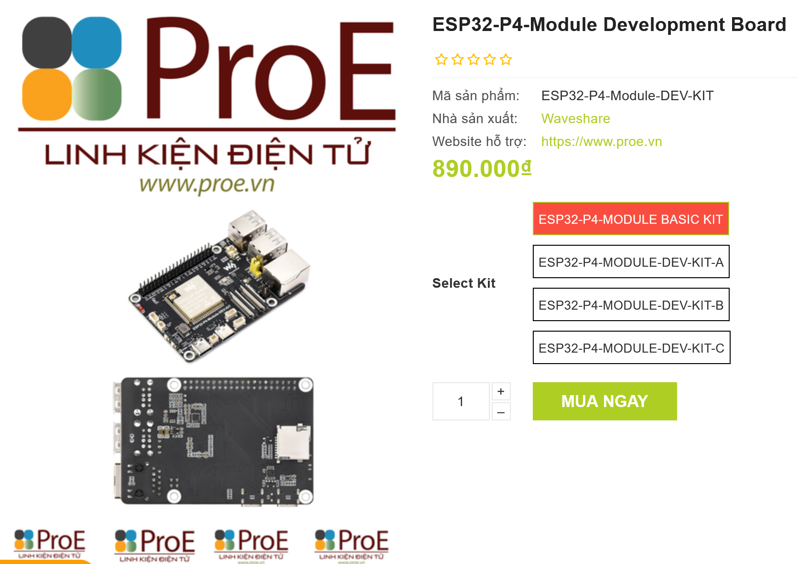
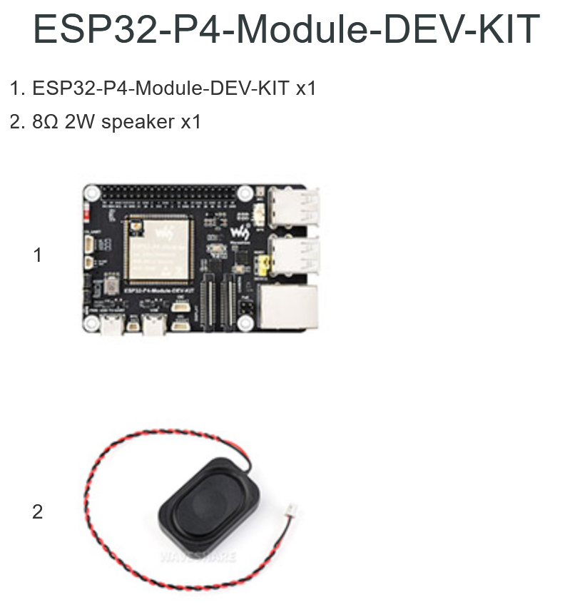
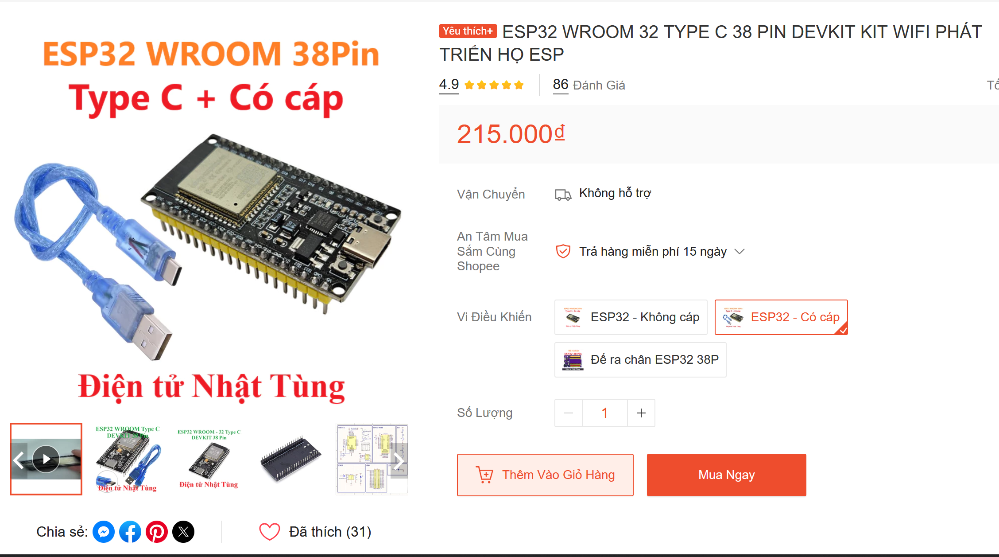

## Vi điều khiển

ESP32 hoặc arduino (arduino khá đắt nên ưu tiên ESP32 nếu mua, ưu tiên ESP32)
Ví dụ: ESP32-P4/ ESP32 WROOM 32

## Sensor

- Nhiệt độ & Độ ẩm: Module BME280 hoặc DHT22
- Chất lượng không khí (CO2): Cảm biến MH-Z19B hoặc MQ135
- Ánh sáng: Module BH1750
- Tiếng ồn/Âm thanh: Module MAX4466 (hoặc tích hợp trong vi điều khiển)

## Thiết bị Cảnh báo cục bộ (Dùng cho Edge Computing)

- Còi báo động (Buzzer)
- Đèn LED (để hiển thị trạng thái) và Điện trở (tránh cháy bóng)

> Có thể 1 trong 2 hoặc cả 2

## Phụ kiện Lắp ráp & Nguồn điện

- Breadboard
- Dây nối
- Cáp truyền dữ liệu: từ thiết bị đến máy tính
- Nguồn cấp: có thể lấy sạc dự phòng khi demo, bình thường thì sài nguồn từ máy tính

Ví dụ 1: Mạch kèm loa (ESP32-P4)

> https://www.proe.vn/esp32-p4-module-development-board
> 

Ví dụ 2: Mạch không kèm loa (ESP32 WROOM 32)

> https://shopee.vn/ESP32-WROOM-32-TYPE-C-38-PIN-DEVKIT-KIT-WIFI-PH%C3%81T-TRI%E1%BB%82N-H%E1%BB%8C-ESP-i.1045034041.24188409447?extraParams=%7B%22display_model_id%22%3A196360683093%2C%22model_selection_logic%22%3A3%7D&sp_atk=21381e36-bf70-4f71-ba5b-6b6e79e88980&xptdk=21381e36-bf70-4f71-ba5b-6b6e79e88980
