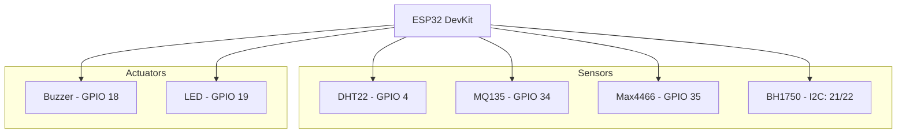

# 🛠 Tài liệu thiết kế Phần cứng (Member 1)

## 1. Danh sách linh kiện (BOM)
- **Controller:** ESP32 DevKit V1 (30 pins).
- **Cảm biến:**
  - DHT22 (Nhiệt độ & Độ ẩm).
  - MQ135 (Chất lượng không khí - cần điện trở 1k-10k nếu dùng mạch rời).
  - BH1750 (Ánh sáng - I2C).
  - Max4466 (Âm thanh - Analog).
- **Cảnh báo:** Còi Buzzer 5V, LED 5mm.
- **Phụ kiện:** Breadboard, dây nối (Jumper wires), cáp Micro-USB.

## 2. Sơ đồ nguyên lý (Circuit Diagram)

## 3. Hướng dẫn lắp đặt
1. **Nguồn điện:** Cấp 5V từ cổng USB của ESP32. Chú ý MQ135 tiêu thụ dòng khá lớn (~150mA) nên cần nguồn ổn định.
2. **Kết nối I2C:** BH1750 kết nối vào chân SDA (GPIO 21) và SCL (GPIO 22).
3. **Chân Analog:** ESP32 ADC1 (GPIO 32-39) hoạt động ổn định hơn ADC2 khi dùng WiFi. Do đó, MQ135 và Sound được cắm vào chân 34 và 35.
4. **Trở kéo:** DHT22 cần trở kéo 4.7k-10k giữa chân VCC và DATA (nếu module không có sẵn).

## 4. Kiểm tra mạch
- Đo điện áp tại các chân VCC của cảm biến đảm bảo đủ 3.3V hoặc 5V.
- Kiểm tra thông mạch giữa GND của ESP32 và các linh kiện.
